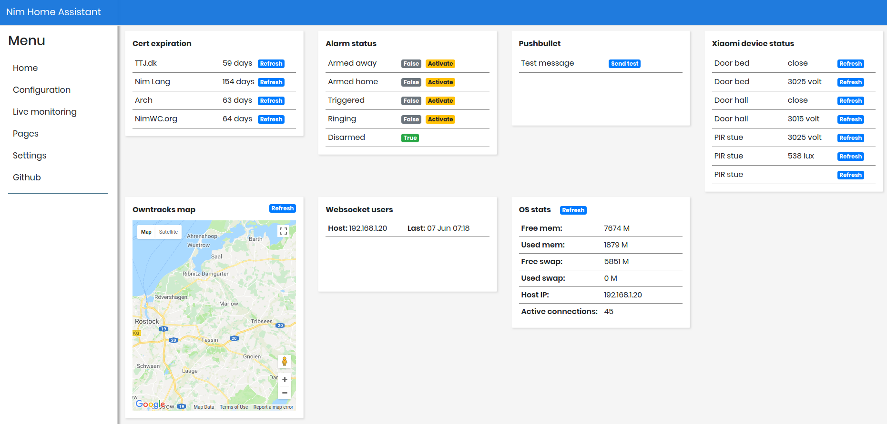

# Nim Homeassistant

Nim Home Assistant (NimHA) is a hub for combining multiple home automation devices and automating jobs. Nim Home Assistant is developed to run on a Raspberry Pi with a 7" touchscreen, mobile devices and on large screens.

# Wiki

Please visit the [Wiki page](https://github.com/ThomasTJdev/nim_homeassistant/wiki) for more information on installation, requirements and the modules.

# Current status

> NimHA is currently in **BETA**.

Work before reaching stable (some might be missing - please add an issue):
- Avoid database lock error (multiple connections at the same time - which SQLite does not like)
- The alarm module's countdown proc() is currently not working (this means that when the alarm has been triggered, it will immediately go into ringing mode)

____

____

# Features

### Dashboard
* Interactive dashboard showing all the data in separate cards.
* Drag and drop the cards in a custom order
* The dashboard uses websocket, so there is no need for refreshing the page - the data renders continuously
* Responsive design for PC's, mobile phones and Raspberry Pi 7" touchscreen

### [Alarm system](https://github.com/ThomasTJdev/nim_homeassistant/wiki/Alarm-system)
* Alarm system integrated with Xiaomi IOT devices
* Custom actions when the alarm status changes, e.g. from armed to ringing
* Custom alarm codes for each user
* User defined arm time

### [Xiaomi IOT devices](https://github.com/ThomasTJdev/nim_homeassistant/wiki/Xiaomi)
* Integrated with Xiaomi Smart Home devices
* Constantly monitor your devices
* Send commands to your device, e.g. play sound on the gateway
* Auto discovery of devices

### [Cronjobs](https://github.com/ThomasTJdev/nim_homeassistant/wiki/Cron-jobs)
* Schedule automatic actions on the minute
* Utilize actions from the different modules, e.g. send mails, notifications, etc.

### [SSL certificate watch](https://github.com/ThomasTJdev/nim_homeassistant/wiki/SSL-certificates-watch)
* Monitor the expiration date on your SSL certificates

### [Owntracks](https://github.com/ThomasTJdev/nim_homeassistant/wiki/Owntracks)
* View where each of your Owntrack devices are located
* Add custom waypoints to the map
* Use [Google maps](https://github.com/ThomasTJdev/nim_homeassistant/wiki/Google-Maps)

### OS stats
* Monitor the health of your system

### [RSS feed](https://github.com/ThomasTJdev/nim_homeassistant/wiki/RSS-feed)
* Keep an eye on your favorite RSS feeds

### [MJPEG stream](https://github.com/ThomasTJdev/nim_homeassistant/wiki/MJPEG-stream)
* Watch your MJPEG stream from the dashboard

### [Pushbullet](https://github.com/ThomasTJdev/nim_homeassistant/wiki/Pushbullet)
* Stay notified with the Pushbullet integration on all your devices

### [Mail](https://github.com/ThomasTJdev/nim_homeassistant/wiki/Mail)
* Connect to your mail server and create mail templates, which can be used in the different modules

### .. and more to come

# Run Nim Home Assistant

### 1) Ensure that all the requirements are fulfilled: [Wiki - Requirements](https://github.com/ThomasTJdev/nim_homeassistant/wiki/Requirements)

### 2) Install and run NimHA: [Wiki - Install](https://github.com/ThomasTJdev/nim_homeassistant/wiki/Install-NimHA)

